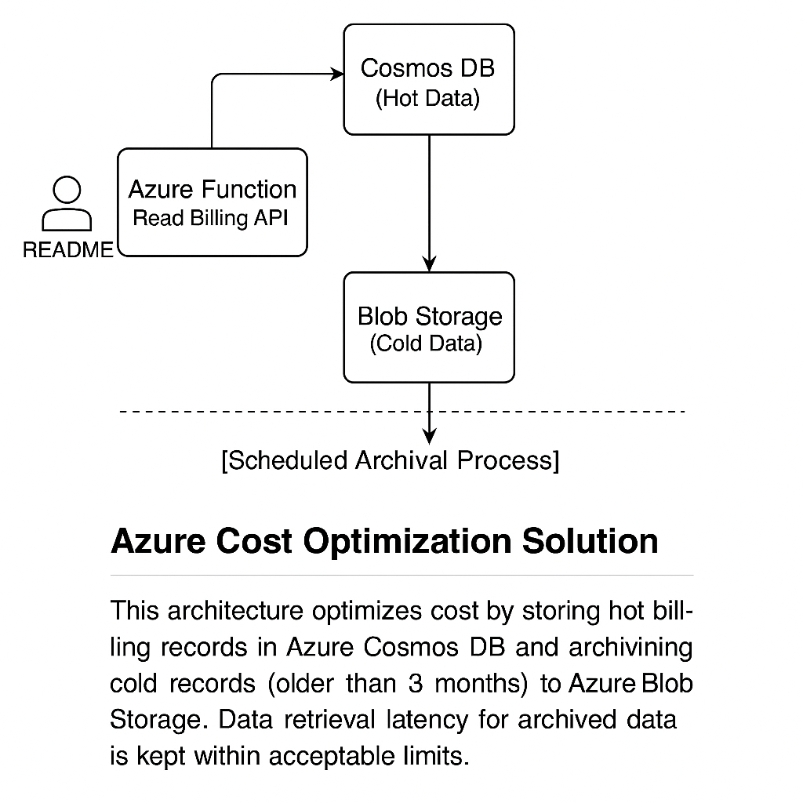

# Azure Cost Optimization Solution

This project demonstrates how to optimize storage costs in a serverless Azure architecture by archiving infrequently accessed billing records from Cosmos DB to Azure Blob Storage.

## Components
- Cosmos DB (hot data)
- Azure Blob Storage (cold data)
- Azure Functions (archival + hybrid read)
- Timer Trigger (scheduled archival)
- No API contract change
- Zero downtime transition

# Cost-Optimization-Challenge
Managing Billing Records in Azure Serverless Architecture
